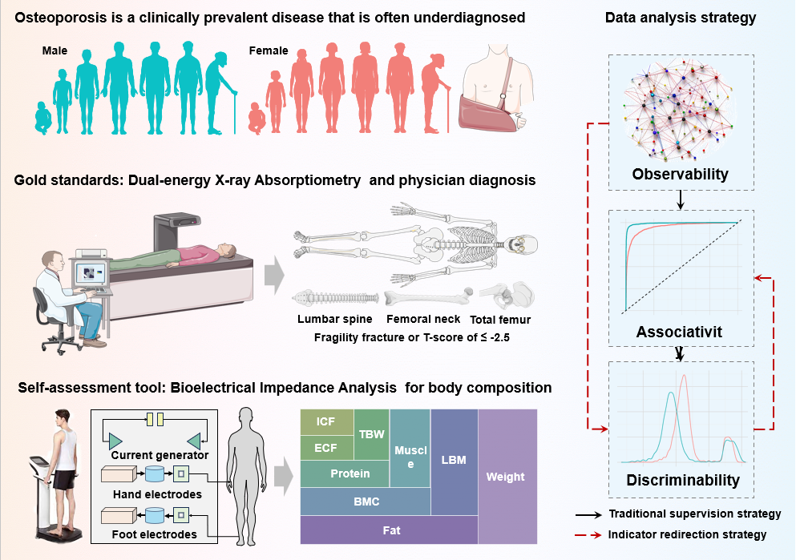

# Muscle-Bone-Imbalance-Fracture-Risk

This repository accompanies a manuscript on a muscle-bone imbalance phenotype associated with fracture-related and osteoporosis-related burden. It documents the study context, dataset availability, downloaded external files, and lightweight public preprocessing/analysis workflows that can help readers reproduce the extension analyses.

## Study Overview



This overview summarizes the methodological logic of the study and the rationale for evaluating a body composition-based muscle-bone imbalance phenotype in relation to osteoporosis and fracture-related risk. It contrasts dual-energy X-ray absorptiometry as the reference standard with bioelectrical impedance analysis as a scalable body-composition assessment tool, and it outlines the discovery cohort, which includes 152,449 healthy adults with measurements for age, height, weight, muscle mass, bone mineral content, fat percentage, intracellular fluid, extracellular fluid, and protein. These body-composition measurements were validated against isotopic labeling, magnetic resonance imaging, and dual-energy X-ray absorptiometry.

Because the discovery dataset does not include reference bone mineral density values, a conventional supervised modeling framework was not applicable. The study therefore adopted an indicator redirection strategy aimed at identifying body-composition indicators with stronger discriminability and then examining their associativity with osteoporosis- and fracture-related outcomes through the external extension datasets.

## How to Use This Repository

This repository is structured around the manuscript rather than around a software package.

Recommended reading order:

1. Start with the current `README.md` for the study rationale and dataset roles.
2. Open `datasets/Chinese-Human-Body-Composition/README.md` for the discovery cohort access note.
3. Open `datasets/NHANES`, `datasets/KNHANES`, and `datasets/HRS` for external dataset-specific preprocessing, analysis strategy, downloaded file records, and concise findings.
4. Use `code/` only if you want to reproduce the public external workflows locally after obtaining the source datasets yourself.

## Study Scope

The manuscript combines:

- one original Chinese discovery dataset,
- three external datasets used for extension and validation:
  - `NHANES`
  - `KNHANES`
  - `HRS`

The goal is not to claim universal transferability of the original Chinese cutoff. Instead, the combined analyses were used to address three distinct questions:

1. Can BIA-derived body composition be bridged to DXA-derived body composition?
2. Does a DXA-derived muscle-to-bone ratio show structural and risk consistency in external populations?
3. Do older-adult clinical outcomes show a compatible age- and sex-related context?

## Chinese Discovery Dataset

The original Chinese dataset is not redistributed in this repository.

### Availability of Data and Material

The **"Human Body Composition Dataset for the Chinese Population"** can be accessed through the National Population Health Data Center:

- main portal: <https://www.ncmi.cn/>
- direct dataset page: <https://www.ncmi.cn//phda/dataDetails.do?id=CSTR:A0006.11.A0005.201905.000346>

License:

- `Creative Commons - Attribution 4.0 International`

This repository instead focuses on the external datasets and the associated reproducible workflow.

## External Datasets

- `NHANES`
- `KNHANES`
- `HRS`

## Reproducibility Map

| Question | Dataset | Main Folder |
| --- | --- | --- |
| Original discovery signal | Chinese Human Body Composition Dataset | `datasets/Chinese-Human-Body-Composition` |
| BIA-to-DXA bridge and DXA-based risk consistency | `NHANES` | `datasets/NHANES` and `code/NHANES` |
| East Asian DXA external consistency | `KNHANES` | `datasets/KNHANES` and `code/KNHANES` |
| Older-adult clinical outcome context | `HRS` | `datasets/HRS` and `code/HRS` |

## Repository Structure

```text
Muscle-Bone-Imbalance-Fracture-Risk/
  README.md
  .gitignore
  assets/
    study_overview.png
  code/
    NHANES/
    KNHANES/
    HRS/
  datasets/
    Chinese-Human-Body-Composition/
      README.md
    NHANES/
      README.md
    KNHANES/
      README.md
    HRS/
      README.md
    TEMPLATE_NEW_DATASET.md
```

## Current Interpretation

- Original Chinese cohort: `BIA-based MBR`
- NHANES / KNHANES: `DXA-derived MBR`
- HRS: `older-adult clinical outcome context`
- Overall concept: `muscle-bone imbalance phenotype`

The current evidence supports the biological, structural, and clinical relevance of this phenotype, while indicating that the original Chinese threshold should be treated as a cohort-specific discovery threshold rather than a universally transferable screening cutoff.

## Data Availability

This repository does **not** include the original Chinese participant-level data, external raw data files, cleaned participant-level datasets, or large local result bundles.

Reasons:

- Some datasets require registration or application.
- Large files are not appropriate for a lightweight GitHub methods repository.
- The purpose here is to document dataset access, preprocessing logic, analysis design, and key findings.

## What This Repository Provides

- dataset-specific notes for the Chinese cohort and the three external datasets,
- downloaded file names, formats, and locally checked version notes for the external datasets,
- lightweight public code for NHANES, KNHANES, and HRS,
- a template for adding future datasets such as `CHARLS` or `SHARE`.

## Public Analysis Code

The public code in this repository is limited to the external datasets:

- `code/NHANES`
- `code/KNHANES`
- `code/HRS`

No public participant-level code or data release is provided here for the original Chinese discovery cohort.

## Citation

If this repository supports your work, please cite the associated manuscript once the final paper details are available.

## Planned Expansion

The current repository includes documentation for:

- `Chinese Human Body Composition Dataset`
- `NHANES`
- `KNHANES`
- `HRS`

Additional datasets can be added later using:

- `datasets/TEMPLATE_NEW_DATASET.md`
