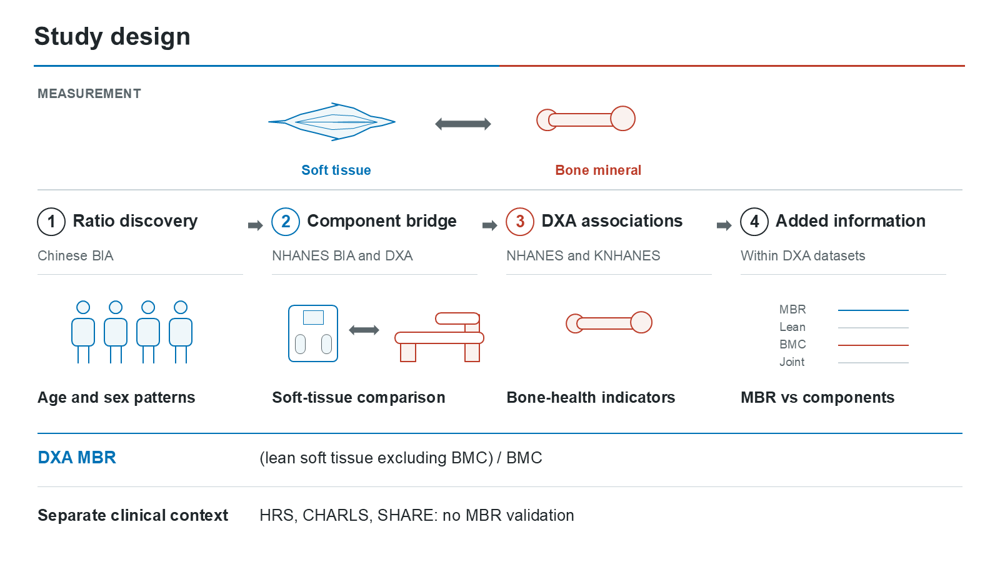

# Muscle-Bone-Imbalance-Fracture-Risk

## Current development snapshot: 0.3.0-rc.1

This snapshot contains the revised cross-sectional analysis and selected aggregate outputs. MBR is evaluated as a candidate proportional descriptor. The NHANES 1999-2004 bridge now analyzes the five DXA imputations separately and pools estimates using Rubin rules. A public Git commit is a development snapshot; no clinical validation or archived DOI is implied.

- [Reproduction instructions and known issues](REPRODUCIBILITY.md)
- [Aggregate results and data dictionary](public_data/README.md)
- [Release and citation instructions](RELEASE.md)
- [Machine-readable citation](CITATION.cff)

`public_data/` contains 13 reviewed aggregate tables. No participant-level records are included. The current analysis entries are `code/Publication/reanalyse.R` and `code/Publication/reanalyse_context.R`; older scripts remain for provenance. The public figures below are previews of the current editable study diagrams.

Key comparisons from ten-fold internal validation: NHANES hip FRAX cross-validated R-squared was 0.162 for the MBR model and 0.194 for flexible components. KNHANES overall osteoporosis cross-validated AUC was 0.912 for MBR and 0.918 for BMC and joint components. These are outcome-specific, covariate-adjusted comparisons, not prospective clinical validation.

This repository documents the public reproducibility workflow for a study on a muscle-bone imbalance phenotype associated with fracture-related and osteoporosis-related burden. It provides dataset access routes, downloaded external file records, preprocessing logic, and modeling scripts for the external analyses.

This repository is not a manuscript-writing repository. It does not include Word/PDF generation scripts, submission files, drafting notes, or local manuscript assembly code.

## Study Overview



[Graphical abstract](assets/graphical_abstract_distinct_20260929.png) | [Previous study design](assets/study_design_20260929.png) | [Previous graphical abstract](assets/graphical_abstract_20260929.png) | [Earlier study overview](assets/study_overview.png)

The study evaluates a body-composition ratio in a Chinese discovery sample and external datasets. The BIA-DXA comparison covers soft-tissue components only; it does not establish MBR equivalence. NHANES and KNHANES provide cross-sectional associations, while HRS, CHARLS, and SHARE provide clinical context without measuring MBR.

## How to Use This Repository

This repository is structured around the manuscript rather than around a software package.

Recommended reading order:

1. Start with the current `README.md` for the study rationale and dataset roles.
2. Open `datasets/Chinese-Human-Body-Composition/README.md` for the discovery cohort access note.
3. Open `datasets/NHANES`, `datasets/KNHANES`, `datasets/HRS`, `datasets/CHARLS`, and `datasets/SHARE` for dataset-specific scope, data-source URLs, preprocessing notes, and concise findings.
4. See `REPRODUCIBILITY.md` for the current analysis commands. The scripts require authorized local access to source datasets.

## Study Scope

The manuscript combines:

- one original Chinese discovery dataset
- five external datasets with distinct association or contextual roles:
  - `NHANES`
  - `KNHANES`
  - `HRS`
  - `CHARLS`
  - `SHARE`

The original Chinese value of 16 is an empirical distribution feature, not a clinical cutoff. The analyses address these five questions:

1. Can BIA-derived body composition be bridged to DXA-derived body composition?
2. Does a DXA-derived muscle-to-bone ratio show structural and risk consistency in external populations?
3. Do U.S. older-adult clinical outcomes show a compatible age- and sex-related context?
4. Do Chinese older-adult clinical outcomes show a compatible age- and sex-related context?
5. Do European older-adult clinical outcomes show a compatible age- and sex-related context?

## Chinese Discovery Dataset

The original Chinese dataset is not redistributed in this repository.

### Availability of Data and Material

The **"Human Body Composition Dataset for the Chinese Population"** can be accessed through the National Population Health Data Center:

- main portal: <https://www.ncmi.cn/>
- direct dataset page: <https://www.ncmi.cn//phda/dataDetails.do?id=CSTR:A0006.11.A0005.201905.000346>

Access and reuse conditions must be checked with the provider. This repository does not grant rights to redistribute that dataset.

This repository instead focuses on the external datasets and the associated reproducible workflow.

## External Datasets

### NHANES

- role: `BIA-DXA bridge` and `DXA-derived MBR` risk consistency
- range used: `1999-2004` and `2013-2014`
- official source: <https://wwwn.cdc.gov/nchs/nhanes/>

### KNHANES

- role: `East Asian DXA structural-consistency analysis`
- range used: `2008-2011`
- official source: <https://knhanes.kdca.go.kr/knhanes/eng/index.do>

### HRS

- role: `U.S. older-adult clinical outcome context`
- range used: `RAND HRS Fat Files 2012-2022`
- official source: <https://hrsdata.isr.umich.edu/data-products>

### CHARLS

- role: `Chinese older-adult clinical outcome context`
- range used: `2011, 2013, 2015, 2018, 2020 main waves` plus `Harmonized CHARLS`
- official source: <https://charls.charlsdata.com/>

### SHARE

- role: `European older-adult clinical outcome context`
- range used: `Gateway Harmonized SHARE Release 9.0.0, 2004-2022`
- official source: <https://releases.sharedataportal.eu/>

## Reproducibility Map

| Question | Dataset | Main Folder |
| --- | --- | --- |
| Original discovery signal | Chinese Human Body Composition Dataset | `datasets/Chinese-Human-Body-Composition` |
| BIA-to-DXA bridge and DXA-based risk consistency | `NHANES` | `datasets/NHANES` and `code/NHANES` |
| East Asian DXA structural consistency | `KNHANES` | `datasets/KNHANES` and `code/KNHANES` |
| U.S. older-adult clinical outcome context | `HRS` | `datasets/HRS` and `code/HRS` |
| Chinese older-adult clinical outcome context | `CHARLS` | `datasets/CHARLS` and `code/CHARLS` |
| European older-adult clinical outcome context | `SHARE` | `datasets/SHARE` and `code/SHARE` |
| Survey-weighted, RCS, and threshold-performance sensitivity analyses | `NHANES` and `KNHANES` | `code/Sensitivity` |
| Revised main and context analyses | `NHANES`, `KNHANES`, `HRS`, `CHARLS`, `SHARE` | `code/Publication` |

## Repository Structure

```text
Muscle-Bone-Imbalance-Fracture-Risk/
  README.md
  .gitignore
  assets/
    study_design_20260929.png
    graphical_abstract_20260929.png
    study_overview.png
  public_data/
    manifest.json
    13 aggregate CSV files
  code/
    Publication/
    NHANES/
    KNHANES/
    HRS/
    CHARLS/
    Sensitivity/
  datasets/
    Chinese-Human-Body-Composition/
      README.md
    NHANES/
      README.md
    KNHANES/
      README.md
    HRS/
      README.md
    CHARLS/
      README.md
    SHARE/
      README.md
    TEMPLATE_NEW_DATASET.md
```

## Current Interpretation

- Original Chinese cohort: `BIA-based MBR`
- NHANES / KNHANES: `DXA-derived MBR`
- HRS / CHARLS / SHARE: `older-adult clinical outcome context`
- Overall concept: `muscle-bone imbalance phenotype`

MBR is a candidate, platform-dependent proportional descriptor. It does not consistently outperform BMC or joint component models. These data do not establish prospective fracture prediction, causal tissue crosstalk, or clinical utility. The empirical Chinese value of 16 has no outcome-based validation.

## Data Availability

This repository does **not** include Chinese or external participant-level data, raw survey files, or large local result bundles. Selected aggregate tables are supplied in `public_data/` with file hashes and a dictionary. These tables support result inspection but cannot replace the original data for model refitting.

Reasons:

- some datasets require registration or application
- large files are not appropriate for a lightweight GitHub methods repository
- the purpose here is to document dataset access, preprocessing logic, analysis design, and key findings

## What This Repository Provides

- dataset-specific notes for the Chinese cohort and the five external datasets
- official dataset source URLs and the exact survey ranges used
- downloaded file names, formats, and locally checked version notes for the external datasets
- lightweight public code for NHANES, KNHANES, HRS, CHARLS, SHARE, and sensitivity analyses
- a template for adding future datasets

## Public Analysis Code

The public code in this repository is limited to the external datasets:

- `code/NHANES`
- `code/KNHANES`
- `code/HRS`
- `code/CHARLS`
- `code/SHARE`
- `code/Sensitivity`
- `code/Publication` (current main and clinical-context analyses)

No public participant-level code or data release is provided here for the original Chinese discovery cohort.

The public code is limited to reproducible data cleaning, variable derivation, and statistical modeling. Scripts used only to draft manuscript text, assemble Word documents, polish submission files, or manage local working notes are intentionally excluded.

## Citation

Use `CITATION.cff` for the software snapshot and cite each source survey separately. The candidate has no minted DOI or published release. After the reviewed version is released and archived, cite its version-specific DOI as described in `RELEASE.md`; do not substitute the preprint DOI for a software DOI.
